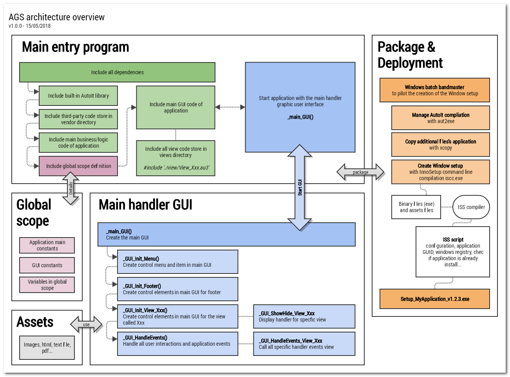
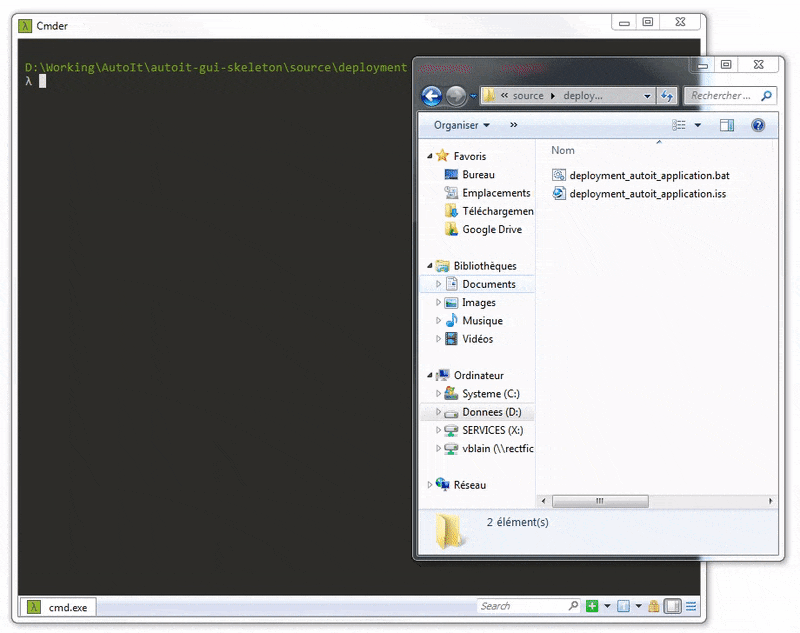
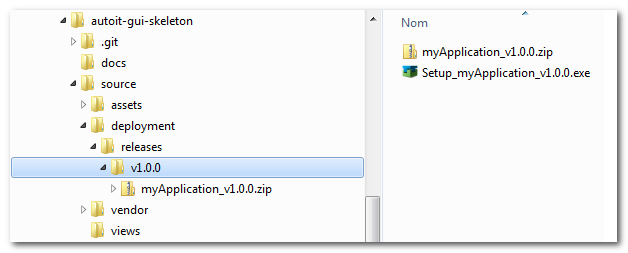
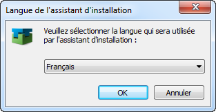
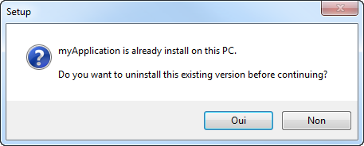
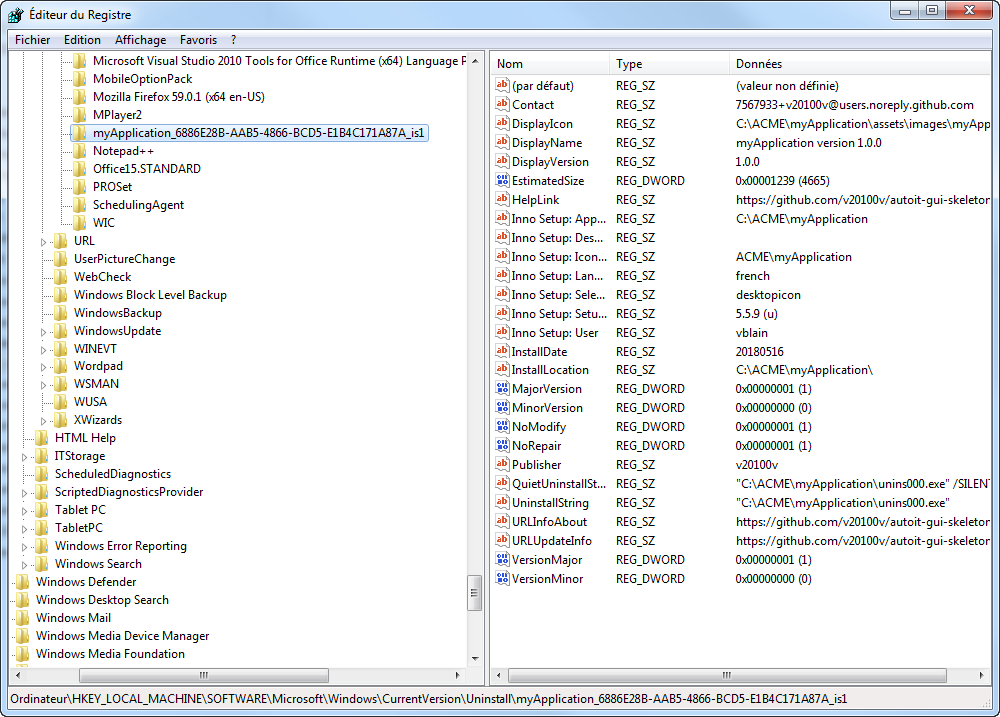
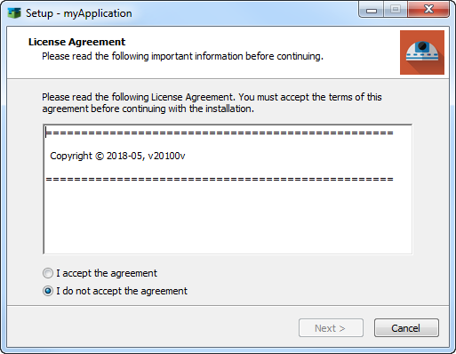
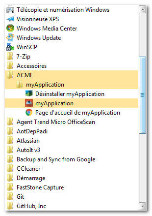
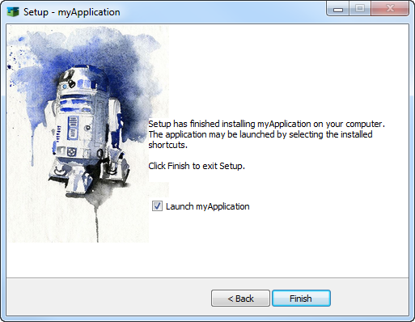

Autoit-Gui-Skeleton (AGS)
=========================

> Fournir une architecture et une organisation pour construire efficacement une application bureautique Windows via la solution AutoIt.

<br/>

- [Autoit-Gui-Skeleton (AGS)](#autoit-gui-skeleton--ags-)
  * [Architecture](#architecture)
    + [Répertoire `assets`](#r-pertoire--assets-)
    + [Répertoire `deployment`](#r-pertoire--deployment-)
    + [Répertoire `vendor`](#r-pertoire--vendor-)
    + [Répertoire `views`](#r-pertoire--views-)
    + [Vue d'ensemble](#vue-d-ensemble)
  * [Organisation du code](#organisation-du-code)
    + [Programme d'entrée principale](#programme-d-entr-e-principale)
    + [Centraliser la déclaration des variables globales](#centraliser-la-d-claration-des-variables-globales)
    + [Ecrire le code métier dans des fichiers spécifiquement dédiés](#ecrire-le-code-m-tier-dans-des-fichiers-sp-cifiquement-d-di-s)
    + [Programme principal pour gérer l'interface graphique](#programme-principal-pour-g-rer-l-interface-graphique)
    + [Déclarez le code de toutes les vues dans des fichiers spécifiquement dédiés](#d-clarez-le-code-de-toutes-les-vues-dans-des-fichiers-sp-cifiquement-d-di-s)
    + [Gestionnaire principal des événements](#gestionnaire-principal-des--v-nements)
    + [Changer de vue](#changer-de-vue)
  * [Package et déploiement](#package-et-d-ploiement)
    + [Motivations](#motivations)
    + [Windows batch, le chef d'orquestre](#windows-batch--le-chef-d-orquestre)
      - [Etape 1/7 : créer le répertoire de sortie](#etape-1-7---cr-er-le-r-pertoire-de-sortie)
      - [Étape 2/7 : Compilation AutoIt du programme principal](#-tape-2-7---compilation-autoit-du-programme-principal)
      - [Étape 3/7 : Copie des assets](#-tape-3-7---copie-des-assets)
      - [Étape 4/7 : Date de génération](#-tape-4-7---date-de-g-n-ration)
      - [Étape 5/7 : Création de l'archive zip](#-tape-5-7---cr-ation-de-l-archive-zip)
      - [Étape 6/7 : Création de l'installeur Windows via InnoSetup](#-tape-6-7---cr-ation-de-l-installeur-windows-via-innosetup)
      - [Étape 7/7 : Suppression du repertoire temporaire de sortie](#-tape-7-7---suppression-du-repertoire-temporaire-de-sortie)
    + [Fonctionnalités de l'installeur](#fonctionnalit-s-de-l-installeur)
      - [Gestion i18n](#gestion-i18n)
      - [Déjà installé ?](#d-j--install---)
      - [Messages complémentaires dans l'installeur : accord licence, prérequis & historique projet](#messages-compl-mentaires-dans-l-installeur---accord-licence--pr-requis---historique-projet)
      - [Ajout dans le menu démarrer Windows](#ajout-dans-le-menu-d-marrer-windows)
      - [Lancer l'application à la fin de l'installation](#lancer-l-application---la-fin-de-l-installation)
      - [Changer les éléments graphiques de l'installeur](#changer-les--l-ments-graphiques-de-l-installeur)
  * [A propos](#a-propos)
    + [Historique](#historique)
    + [Contribution](#contribution)
    + [Licence](#licence)


<br/>

## Architecture

Pour organiser le code d'une application AutoIT avec une interface graphique, on se propose d'utiliser le modèle suivant :

```
project root folder
|
|   myApplication.au3          # Main entry program
|   myApplication_GLOBAL.au3   # All global variables declaration
|   myApplication_GUI.au3      # Main program to handle GUI
|   myApplication_LOGIC.au3    # Business code only
|   README.md                  # Cause We always need it
|  
+---assets                     # All applications assets (images, files...)
|   +---css
|   +---html
|   +---images
|   \---javascript
|
+---deployment                
|   \---releases               # Contains releases setup (zip and Windows setup files)
|   deployment.bat             # Windows batch bandmaster to pilot the creation of the Windows setup
|   deploymeny.iss             # ISS to generate Windows setup
|
+---vendor                     # All third-party code use in this project
|   \--- FolderVendor
|              
\---views                      # Views declaration
    View_About.au3
    View_Footer.au3
    View_Welcome.au3
```


### Répertoire `assets`

Ce répertoire contient les éléments utilisés dans l'application comme des images, des fichiers textes, pdf, html, css, javascript. En effet, remarquons qu'il est possible d’intégrer dans une application AutoIt, un fichier html statique, dans un navigateur web incorporé dans l'IHM avec la méthode `_IECreateEmbedded()` fournit par la librairie `IE.au3`.


### Répertoire `deployment`

Ce répertoire contient un batch Windows qui pilote la création d'un installeur Windows avec la solution [InnoSetup](http://www.jrsoftware.org/isinfo.php). Pour faire fonctionner le batch, il est nécessaire que le compilateur d'InnoSetup et que 7zip soit installer sur le poste client. Si ce n'est pas le cas, je vous conseille d'utiliser le gestionnaire de package Windows [Chocolatey](https://chocolatey.org/) pour les installer simplement :

```
C:\> choco install 7zip
C:\> choco install innosetup
```


### Répertoire `vendor`

Ce répertoire est l'endroit par convention où stocker le code développé par des tiers dans un projet. Dans ce projet (https://github.com/v20100v/autoit-gui-skeleton), nous avons par exemple mis la bibliothèque GUICtrlOnHover v2.0 créée par G.Sandler a.k.a MrCreatoR dans ce répertoire.


### Répertoire `views`

Ce répertoire contient les gestionnaires des vues. Tout le code de toutes les vues sont définis à chaque fois dans un fichier spécifique et stockés dans ce répertoire.


### Vue d'ensemble




<br/>

## Organisation du code

> Explication de l'organisation du code d'un projet respectant les conventions AGS. Nous décrivons ci-dessous ses éléments principaux.

### Programme d'entrée principale

Le programme `myApplication.au3` nous sert de point d'entrée unique de notre application. C'estl ui qui démarre l'application. Dans ce dernier on commence par inclure toutes les autres dependances qu'il a besoin : librairies d'AutoIt, librairies tierces, la déclaration des variables globales, le code de l'application GUI et métier. Il appelle une seule méthode : `_main_GUI()`. C'est le gestionnaire principale de l'interface graphique qui sert à construire l'interface et gérer les interactions utilisateurs.

```AutoIt
;; myApplication.au3 ;;

Opt('MustDeclareVars', 1)

; Include all built-in AutoIt library requires
#include <IE.au3>
#include <GUIConstantsEx.au3>
#include <WinAPIDlg.au3>

; Include all third-party code in a project store in vendor directory
#include 'vendor/GUICtrlOnHover/GUICtrlOnHover.au3'

; Include myApplication scripts
#include 'myApplication_GLOBAL.au3'
#include 'myApplication_GUI.au3'
#include 'myApplication_LOGIC.au3'

; Start main graphic user interface defined in myApplication_GUI.au3
_main_GUI()
```


### Centraliser la déclaration des variables globales

Ce script est utilisé pour définir toutes les constantes et variables de l'application dans la portée globale du programme, à l'exception des éléments graphiques, qui eux sont définis dans un fichier de vue spécifique. De plus par convention, toutes les variables déclarées dans `myApplication_GLOBALS.au3` doivent être écrites en majuscules et séparés par des underscores.

On utilise la déclaration `Global` pour indiquer explicitement quel accès à la portée est souhaité pour une variable. Si vous déclarez une variable avec le même nom qu'un paramètre, en utilisant Local dans une fonction utilisateur, une erreur se produira. Global peut être utilisé pour affecter des variables globales à l'intérieur d'une fonction, mais si une variable locale (ou un paramètre) a le même nom qu'une variable globale, la variable locale sera la seule utilisée. Il est recommandé que les variables locales et globales aient des noms distincts.

On utilise la déclaration `Global Const` pour déclarer une constante. Une fois créée une constante globale, vous ne pouvez pas changer la valeur d'une constante. En outre, vous ne pouvez pas remplacer une variable existante par une constante.

```AutoIt
;; myApplication_GLOBAL.au3 ;;

; Application main constants
Global Const $APP_NAME = "myApplication"
Global Const $APP_VERSION = "1.0.0"
Global Const $APP_WEBSITE = "https://myApplication-website.org"
Global Const $APP_EMAIL_CONTACT = "myApplication@website.org"
Global Const $APP_ID = "acme.myApplication"
Global Const $APP_LIFE_PERIOD = "2016-"&@YEAR
Global Const $APP_COPYRIGHT = "© "&$APP_LIFE_PERIOD&", A.C.M.E."

; Application GUI constants
Global Const $APP_WIDTH = 800
Global Const $APP_HEIGHT = 600
Global Const $APP_GUI_TITLE_COLOR = 0x85C4ED
Global Const $APP_GUI_LINK_COLOR = 0x5487FB

; Application global variable
; Example in order to persist an opened file on action "File > Open"
Global $OPEN_FILE = False
Global $OPEN_FILE_PATH = -1
Global $OPEN_FILE_NAME = -1
```


### Ecrire le code métier dans des fichiers spécifiquement dédiés

Dans ce modèle, nous ajoutons un fichier `myApplication_LOGIC.au3` qui contient toutes les méthodes du code métier. Ces méthodes logiques sont ensuite appelées par d'autres généralement déclenchées par des interactions utilisateur, dont les liens sont définies dans l'interface graphique. Principe simple de séparation entre logique et vue.

Par exemple, nous gérons une boîte de dialogue de la façon suivante:

```AutoIt
;; myApplication_LOGIC.au3 ;;

;===========================================================================================================
; Show a dialog box to user, in order that he chooses a file in the Windows Explorer
;
; @params : void
; @return : $array_result[0] = file path
;           $array_result[1] = file name
;===========================================================================================================
Func _dialogbox_open()
   Local $info_fichier = _WinAPI_GetOpenFileName("Open file", "*.*", @WorkingDir, "", _
                          "", 2, BitOR($OFN_ALLOWMULTISELECT, $OFN_EXPLORER), _
              $OFN_EX_NOPLACESBAR)
   Local $array_result[2]

   If @error Then
      $array_result[0] = -1
      $array_result[1] = -1
   Else
      ; Chemin relatif du nouveau fichier
      $array_result[0] = $info_fichier[1]&"\"&$info_fichier[2] ; $PATHFILE_OF_OPEN_FILE_IN_APP
      $array_result[1] = $info_fichier[2] ; $NAME_OF_OPEN_FILE_IN_APP
   EndIf

   Return $array_result
EndFunc
```


### Programme principal pour gérer l'interface graphique

Le fichier `myApplication_GUI.au3` contient la méthode `_main_GUI()` qui est appelé par le programme d'entrée principal. Cette méthode est conçue pour créer l'interface utilisateur graphique (GUI) et gérer toutes les interactions et tous les événements de l'utilisateur. Ainsi elle appelle toutes les autres méthodes qui initialise les éléments de l'interface graphique.

```AutoIt
;; myApplication_GUI.au3 ;;

#include-once

; Includes all views definition
#include './views/View_Footer.au3'
#include './views/View_Welcome.au3'
#include './views/View_About.au3'

;==============================================================================================================
; Main graphic user interface
;
; @param void
; @return void
;==============================================================================================================
Func _main_GUI()
   Global $main_GUI = GUICreate($APP_NAME, $APP_WIDTH, $APP_HEIGHT, -1, -1)

   _GUI_Init_Menu()

   _GUI_Init_Footer()       ; By default all elements of this view are visible
   _GUI_Init_View_Welcome() ; By default all elements of this view are hidden
   _GUI_Init_View_About()   ; By default all elements of this view are hidden

   ; Set configuration application : icon, background color
   _GUI_Configuration()

   ; Show Welcome view on startup
   _GUI_ShowHide_View_Welcome($GUI_SHOW)
   GUISetState(@SW_SHOW)

   ; Handle all user interactions and events
   _GUI_HandleEvents()

   GUIDelete()
   Exit
EndFunc

(...)
```

Quelques commentaires:

- Toutes les variables majuscules (`$ APP_NAME`,` $ APP_WIDTH`, `$ APP_HEIGHT`) sont déclarées dans la portée globale de l'application. Leur définition se fait dans le fichier `myApplication_GLOBAL.au3`;
- `_GUI_Init_Menu()` est utilisé pour créer un contrôle de menu dans l'interface graphique principale;
- `_GUI_Init_Footer()` est utilisé pour créer des éléments de pied de page dans l'interface graphique principale. Sa définition est faite dans un fichier spécial séparé. Tous les éléments de pied de page sont visibles dans toutes les vues par défaut, nous n'avons donc pas besoin de gérer sa visibilité.
- `_GUI_Init_View_Welcome()` est utilisé pour créer des éléments GUI pour un nom de vue "Welcome". Tous les éléments déclarés dans cette méthode sont masqués par défaut. Pour afficher la vue "Welcome", c'est-à-dire pour la rendre visible, appelez simplement la méthode avec ce paramètre `_GUI_ShowHide_View_Welcome($ GUI_SHOW)`. Et pour les cacher, appelez simplement `_GUI_ShowHide_View_Welcome($ GUI_HIDE)`;
- `_GUI_HandleEvents()` gère toutes les interactions et les événements utilisateur en analysant le message de retour avec la méthode `GUIGetMsg()`. Le retour d'événement avec la méthode GUIGetMsg est l'ID de contrôle du contrôle qui envoie le message. Cette méthode appelle un autre événement de gestionnaire spécifique par vue, par exemple `_GUI_HandleEvents_View_Welcome($msg)`;


### Déclarez le code de toutes les vues dans des fichiers spécifiquement dédiés

Par exemple pour la gestion de la création des éléments graphique de la vue "Welcome", on utilise la méthode `_GUI_Init_View_Welcome()`.

```AutoIt
;; ./view/View_Welcome.au3 ;;

Func _GUI_Init_View_Welcome()
   ; Create GUI elements here for "Welcome view" in global scope
   Global $label_title_View_Welcome = GUICtrlCreateLabel("Welcome", 20, 30, 400)
EndFunc
```

Pour la gestion de l'affichage des éléments de la vue "Welcome", on utilise la méthode `_GUI_ShowHide_View_Welcome($action)`

```AutoIt
;; ./view/View_Welcome.au3 ;;

Func _GUI_ShowHide_View_Welcome($action)
   Switch $action
      Case $GUI_SHOW
         ; Define here all elements to show when user come into this view
         _GUI_Hide_all_view() ; Hide all elements defined in all method _GUI_ShowHide_View_xxx
         GUICtrlSetState($label_title_View_Welcome, $GUI_SHOW)
         GUICtrlSetState($label_welcome, $GUI_SHOW)

      Case $GUI_HIDE
         ; Define here all elements to hide when user leave this view
         GUICtrlSetState($label_title_View_Welcome, $GUI_HIDE)
         GUICtrlSetState($label_welcome, $GUI_HIDE)
    EndSwitch
EndFunc
```

Pour la gestion des événements dans la vue "Welcome", on utilise la méthode `_GUI_HandleEvents_View_Welcome($msg)`. Cette méthode est appelée dans la méthode du gestionnaire principal `_GUI_HandleEvents()`.

```AutoIt
;; ./view/View_Welcome.au3 ;;

Func _GUI_HandleEvents_View_Welcome($msg)
   Switch $msg

      ; Trigger for click on $image_banner
      Case $label_welcome
         ConsoleWrite('Click on "$label_welcome"' & @CRLF)

      ; Add another trigger in view 'Welcome' here
   EndSwitch
EndFunc
```


### Gestionnaire principal des événements

Le gestionnaire principal des événements utilisateurs et dans l'application se nomme `_GUI_HandleEvents()`. C'est ce dernier qui va appelé tous les autres gestionnaires d'événement spécifique à chaque vue. Ils sont nommés par convention `_GUI_HandleEvents_View_Xxx($msg)`.

```AutoIt
;; myApplication_GUI.au3 ;;

Func _GUI_HandleEvents()
   Local $msg
   While 1
    ; event return with GUIGetMsg method, i.e. the control ID of the control sending the message
    $msg = GUIGetMsg()
      Switch $msg
         ; Trigger on close dialog box
         Case $GUI_EVENT_CLOSE
            ExitLoop

         ; Trigger on click on item menu 'File > Exit'
         Case $menuitem_Exit
            ExitLoop
      EndSwitch

      _GUI_HandleEvents_View_Welcome($msg)
      _GUI_HandleEvents_View_About($msg)
      _GUI_HandleEvents_Menu_File($msg)
      _GUI_HandleEvents_Menu_About($msg)
   WEnd
EndFunc
```


### Changer de vue

Pour passer d'une vue de départ à une autre vue d'arrivée, il suffit d'abord de masquer tous les éléments graphiques, puis dans un second temps d'afficher uniquement ceux de la vue d'arrivée. Alors, comment cacher tous les éléments graphiques? Juste avec une méthode `_GUI_Hide_all_view()` qui va appelle le gestionnaire de visibilité de chaque vue. Ces derniers sont nommés par convention `_GUI_ShowHide_View_Xxx`.

```AutoIt
;; myApplication_GUI.au3 ;;

Func _GUI_Hide_all_view()
   _GUI_ShowHide_View_Welcome($GUI_HIDE)
   _GUI_ShowHide_View_About($GUI_HIDE)
EndFunc
```

<br/>

## Package et déploiement

### Motivations

Pour faciliter le déploiement d'une application bureautique Windows, on se propose de construire un installeur Windows avec la solution [InnoSetup](http://www.jrsoftware.org/isinfo.php).

Pour préparer un package et génerer un installeur, les grandes étapes consiste à :

- Attribuer un numéro de version à l'application ;
- Compiler l'application via le point d'entrée principal `myApplication.au3` avec le compilateur `aut2exe` ;
- Copier les assets (images, fichiers...) nécessaires au bon fonctionnement de l'application dans le répertoire de sortie ;
- Créer une archive zip pour recetter l'application ;
- Et enfin construire l'installeur en compilant le script InnoSetup associé.

Toutes les étapes, pour packager l'application et générer l'installeur, peuvent être pilotées depuis un batch Windows, pour des raisons évidentes de rejouabilité et de facilité.


### Windows batch, le chef d'orquestre

C'est le fichier batch Windows `.\deployment\deployment_autoit_application.bat` qui joue le rôle de chef d'orquestre. Dans le répertoire `.\deployment`, il va créer les répertoires `\releases\vx.y.z\` où seront construits l'archive zip de l'application et l'installeur Windows.



Pour ce faire, il va suivre les 7 étapes suivantes :


<br/>

#### Etape 1/7 : créer le répertoire de sortie

Avant l'execution du batch, il est nécessaire de renseigner différentes variables :

   Variable  |   Description
-------------|-----------------
`%VERSION%`       |  Version attribué à l'application.
`%NAME_PROJECT%`  |  Sert pour nommer l'éxécutable de l'application. Remarquons que le numéro de version apparaît également dans le nom de l'éxéctuable.
`%AUT2EXE_AU3%`   |  Le nom du fichier AutoIt principal (`myApplication.au3`)
`%AUT2EXE_ICON%`  |  L'îcone de l'application (`%FOLDER_SRC%\assets\images\myApplication.ico`)
`%ZIP_CLI%`       |  Chemin du binaire 7zip pour créer une archive (`"C:\Program Files\7-Zip\7z.exe"`). Je vous conseille de l'installer via le gestionnaire Chocolatey.
`%ISCC_CLI%`      |  Chemin du binaire du compilateur InnoSetup (`"C:\Program Files (x86)\Inno Setup 5\ISCC.exe"`). Je vous conseille de l'installer via le gestionnaire Chocolatey.

A partir de ces variables, il va construire le repertoire de sortie, dans lequel le fichier AutoIt principal sera compiler : `.\releases\v1.0.0\myApplication_v1.0.0\`.


<br/>

#### Étape 2/7 : Compilation AutoIt du programme principal

On compile le programme princial AutoIt en ligne de commande avec le binaire `aut2exe`. Attention, il est nécessaire que ce dernier soit renseigner dans la variable d'environnement PATH du système d'exploitation.

```Batch
:: deployment_autoit_application.bat ::

(...)

set AUT2EXE_ARGS=/in "%FOLDER_SRC%\%AUT2EXE_AU3%" /out "%FOLDER_OUT%\%NAME_EXE%" /icon
aut2exe %AUT2EXE_ARGS%
echo Compilation AutoIt is finished.
```


<br/>
#### Étape 3/7 : Copie des assets

On copie dans le répertoire de sortie, toutes les assets (images, fichiers...) nécessaires au bon fonctionnement de l'application et à la génération de l'installeur.


<br/>
#### Étape 4/7 : Date de génération

Pour tracer la date de génération, on créé un fichier intitulé `".v%VERSION%"` dans le repertoire de sortie.


<br/>
#### Étape 5/7 : Création de l'archive zip

La création de l'archive zip necessite que 7zip soit installé sur le poste et que la variable `%ZIP_CLI%` soit correctement renseigner vers le chemin du binaire. La commande qui générer l'archive est la suivante :

```Batch
set ZIP_CLI="C:\Program Files\7-Zip\7z.exe"

%ZIP_CLI% a -tzip %NAME_PROJECT%_v%VERSION%.zip "%NAME_PROJECT%_v%VERSION%
echo * The zip has been created.
```


#### Étape 6/7 : Création de l'installeur Windows via InnoSetup

C'est le fichier InnoSetup `.\deployment\deployment_autoit_application.iss` qui contient toutes les instructions pour générer l'installeur Windows associé.

On passe les arguments definis dans le batch Windows au script ISS via le jeu `/dNameVariable=ValueVariable` en ligne de commande. Ainsi il est suffisant de configurer qu'une seul fois les variables projet (nom, version...) dans le fichier batch Windows.

> **!!! Attention !!!**
>
> Dans le fichier script ISS, il existe d'autres variables à configurer  : `ApplicationPublisher`, `ApplicationURL`, `ApplicationGUID`, ...

```Batch
set ISCC_CLI="C:\Program Files (x86)\Inno Setup 5\ISCC.exe"
set ISCC_SCRIPT=deployment_autoit_application.iss

echo * Launch compilation with iscc
%ISCC_CLI% %ISCC_SCRIPT% /dApplicationVersion=%VERSION% /dApplicationName=%NAME_PROJECT%
echo * Compilation has been finished.
```


<br/>
#### Étape 7/7 : Suppression du repertoire temporaire de sortie

Il est suffisant de ne garder que l'archive Zip et l'installeur Windows à la fin du processus.




<br/>
### Fonctionnalités de l'installeur


#### 1 - Gestion de l'i18n

Pour ajouter une nouvelle langue, il suffit d'ajouter dans la section `[languages]` la langue fournit dans le compilateur. Cela va traduire l'ensemble des messages natifs à InnoSetup. Attention à l'expcetion des boutons OUI/NON utilisé dans MsgBox. C'est dernier serton forcement dans la langue du système d'exploitation.

```
[Languages]
Name: "en"; MessagesFile: compiler:Default.isl;
Name: "french"; MessagesFile: "compiler:Languages\French.isl"
```

Pour traduire les autres messages, il suffit de les déclarer dans la section `[CustomMessages]`, en préfixant les variables avec la langue (`en`, `french`, `nl`, ...). Plus d'information : http://www.jrsoftware.org/ishelp/index.php?topic=languagessection

```
[CustomMessages]
french.CheckInstall=est déjà installé sur ce PC.
french.CheckInstallAction=Souhaitez-vous désinstaller cette version existante avant de poursuivre?
en.CheckInstall=is already install on this PC.
en.CheckInstallAction=Do you want to uninstall this existing version before continuing?
```

Ainsi au démarrage de l'installeur, ce dernier demande à l'utilisateur de choisir la langue qu'il doit utiliser.




<br/>
#### 2 - Déjà installé ?

Pour éviter d'installer plusieurs fois l'application sur le poste client, l'installeur vérifie au préalable qu'il bn'est pas déjà présent.



Pour ce faire, il se base sur le GUID (global unique identifiant) définit dans le script InnoSetup. Il est important de ne pas changer de code entre différentes version d'application et qu'il soit bien unique. L'IDE fournit par InnoSetup fournit un outil pour en générer un nouveau accessible via le menu : *Tools > Generate GUID inside the IDE*.

```
; NOTE: The value of AppId uniquely identifies this application.
; Do not use the same AppId value in installers for other applications.
; (To generate a new GUID, click Tools | Generate GUID inside the IDE.)
#define ApplicationGUID "6886E28B-AAB5-4866-BCD5-E1B4C171A87A"
#define ApplicationID ApplicationName + "_" + ApplicationGUID
```

De plus l'installeur ajoute dans la base de registre Windows la clé `SOFTWARE\Microsoft\Windows\CurrentVersion\Uninstall\{#ApplicationID}_is1`. Lorsque l'application est desinstallé, cette clé est supprimé. Ainsi il nous suffit de vérifier la présence de cette clé dans la base de registre pour savoir si l'application a déjà été installé.




<br/>
#### 3 - Messages complémentaires dans l'installeur : accord licence, prérequis & historique projet

Pour configurer les différents messages à afficher dans l'installeur, notamment les accords de licence, il suffit de renseigner les fichiers textes dans le repertoire `./assets/`

- AFTER_INSTALL.txt : généralement pour afficher la roadmap et historique projet ;
- BEFORE_INSTALL.txt : généralement pour afficher les prérequis de l'application ;
- LICENSE.txt :  la licence d'utilisation.




<br/>
#### 4 - Ajout dans le menu démarrer Windows

Pour ajouter des éléments dans le menu démarrer de Windows, on renseigne la section `[Icons]` dans le script InnoSetup de la manière suivante :

```Pascal
[Icons]
Name: "{group}\{#ApplicationName}"; Filename: "{app}\{#ApplicationExeName}"; IconFilename: {app}\assets\images\myApplication.ico;
Name: "{group}\{cm:ProgramOnTheWeb,{#ApplicationName}}"; Filename: "{#ApplicationURL}";
Name: "{group}\{cm:UninstallProgram,{#ApplicationName}}"; Filename: "{uninstallexe}"; IconFilename: {app}\assets\images\setup.ico;
Name: "{commondesktop}\{#ApplicationName}"; Filename: "{app}\{#ApplicationExeName}"; IconFilename: {app}\assets\images\myApplication.ico; IconIndex: 0
```

Et on obtient :




<br/>
#### 5 - Lancer l'application à la fin de l'installation




<br/>
### Changer les éléments graphiques de l'installeur

On a 2 images et 2 icones utilisés dans l'installeur. Elles sont stockées dans le répertoire `.\assets\images`. Les images sont forcement au format bmp et doivent respecter des tailles standards.

Images use in setup       | File  | Comments
--------------------------|-------|---------
UninstallDisplayIcon      | .\assets\images\myApplication.ico | Must be an ico
SetupIconFile             | .\assets\images\setup.ico  | Must be an ico
WizardImageFile           | .\assets\images\innosetup_background.bmp  |  Must be a 500x313 bmp image
WizardSmallImageFile      | .\assets\images\innosetup_image.bmp  | Must be a 50x50 bmp image

Dans le script InnoSetup, elles sont utilisées de la manière suivante :

```Pascal
UninstallDisplayIcon={app}\assets\images\myApplication.ico
WizardImageFile={#PathAssets}\images\innosetup_background.bmp
WizardSmallImageFile={#PathAssets}\images\innosetup_image.bmp
SetupIconFile={#PathAssets}\images\setup.ico
```


<br/>

## A propos


### Historique

 - AGS v1.0.0 - 2018.05.16


### Contribution

Vos commentaires, pull-request et stars sont toujours les bienvenues !


### Licence

Copyright (c) 2018 by [v20100v](https://github.com/v20100v). Released under the [Apache license](https://github.com/v20100v/autoit-gui-skeleton/blob/master/LICENSE.md).
