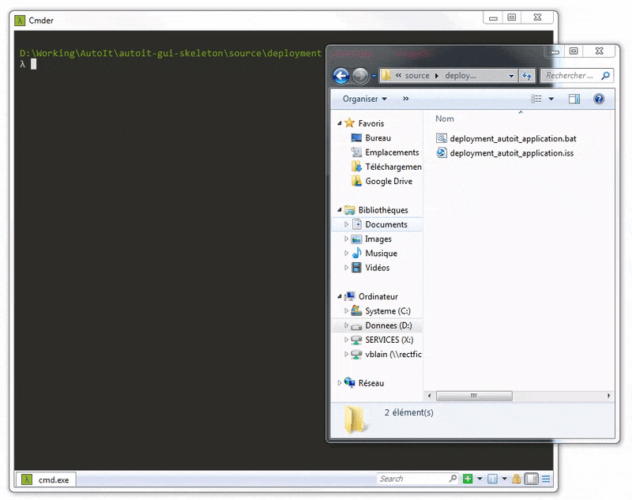

Autoit-Gui-Skeleton (AGS)
=========================

*Read this file in other languages: [English](README.md), [French](README.FR.md)*

<br/>

> Proposes to provide an architecture and an organization to efficiently build an desktop application Windows with AutoIt.
>
> For **documentation**, visit [https://v20100v.github.io/autoit-gui-skeleton/](https://v20100v.github.io/autoit-gui-skeleton/)

<br/>

- [Autoit-Gui-Skeleton (AGS)](#autoit-gui-skeleton--ags-)
  * [What is AGS ?](#what-is-ags--)
  * [Architecture and overview of an AGS project](#architecture-and-overview-of-an-ags-project)
    + [Directories and files of AutoIt project](#directories-and-files-of-autoit-project)
      - [Directory `assets`](#directory--assets-)
      - [Directory `deployment`](#directory--deployment-)
      - [Directory `vendor`](#directory--vendor-)
      - [Directory `views`](#directory--views-)
    + [Overview of AGS architecture](#overview-of-ags-architecture)
      - [Main entry program](#main-entry-program)
      - [Main handler GUI](#main-handler-gui)
      - [Centralize declaration of variables in global scope](#centralize-declaration-of-variables-in-global-scope)
      - [Package and setup deployment](#package-and-setup-deployment)
    + [Example of AGS project](#example-of-ags-project)
  * [About](#about)
    + [Release history](#release-history)
    + [Contributing](#contributing)
    + [License](#license)
    
<br />

## What is AGS ?

AutoIt Gui Skeleton (AGS) give an environment for developers, that makes it easy to build AutoIt applications.

In order to organize the code of an AutoIT application, AGS propose to use conventions and a following model to develop and build AutoIt application with an graphic user interface (GUI).

<br/>


## Architecture and overview of an AGS project

An AGS project respects the following organization for its files and directories.

```
project root folder
|
|   myApplication.au3          # Main entry program
|   myApplication_GLOBAL.au3   # All global variables declaration
|   myApplication_GUI.au3      # Main program to handle GUI
|   myApplication_LOGIC.au3    # Business code only
|   README.md                  # Cause We always need it
|  
+---assets                     # All applications assets (images, files...)
|   +---css
|   +---html
|   +---images
|   \---javascript
|
+---deployment                
|   \---releases               # Contains releases setup (zip and Windows setup files)
|   deployment.bat             # Windows batch bandmaster to pilot the creation of the Windows setup
|   deploymeny.iss             # ISS to generate Windows setup
|
+---vendor                     # All third-party code use in this project
|   \--- FolderVendor
|              
\---views                      # Views declaration
    View_About.au3
    View_Footer.au3
    View_Welcome.au3
```

### Directories and files of AGS project

We organize the files of an AutoIt project in specific directories.


#### Directory `assets`

This directory contains the elements used in the application like images, text files, pdf, html, css, javascript. This folder contains all local files need into the application.


#### Directory `deployment`

This directory contains a Windows batch that controls the creation of a Windows installer with the [InnoSetup](http://www.jrsoftware.org/isinfo.php) solution. To run the batch, it is necessary that the InnoSetup compiler and 7zip be installed on the pc. If this is not the case, I advise you to use the Windows package manager [Chocolatey](https://chocolatey.org/) to install them simply:

```
C: \> choco install 7zip
C: \> choco install innosetup
```


#### Directory `vendor`

This directory is the place where to conventionally store the code developed by third parties in a project. In this project (https://github.com/v20100v/autoit-gui-skeleton), we have for example put the GUICtrlOnHover v2.0 library created by G.Sandler a.k.a MrCreatoR in this directory.


#### Directory `views`

This directory contains view managers. All the code of all the views are defined each time in a specific file and stored in that directory.


<br/>

### Overview of AGS architecture


#### Main entry program

The main entry program serves as a single point of entre for AutoIt application. This is the location where the application starts. In the latter we start by including all the other dependencies that it needs: libraries of AutoIt, third-party libraries, the declaration of global variables, the code of the application GUI and business.

It starts application with the main handler GUI `_main_GUI()`.

#### Main handler GUI

The main handler GUI contains the `_main_GUI()` method which is only called by the main entry program. This method is designed to create the graphical user interface (GUI) and manage all user interactions and events.

#### Centralize declaration of variables in global scope

All constants and global variables are set in one place, in the file `myProject_GLOBALS.au3`. With the exception of all global variables of graphic elements which are set in each specific view file. It is recalled that constants can no longer change their value over time, unlike global variables.

By convention, all the global variables must be written in capital letter and separated by underscore. For example : `Global Const $APP_EMAIL_CONTACT`

#### Package and deployment

In order to facilitate the deployment of a Windows desktop application develop with AutoIt, we propose to use an automated process to build a Windows installer with the [InnoSetup](http://www.jrsoftware.org/isinfo.php) solution. In AGS we use a Windows batch file, called `.deployment_autoit_application.bat`, which plays the role of orquestrian leader in the generation of the setup. In the `\Deployment` directory, it will create the `\releases\vx.y.z\` directories where the application zip archive and the Windows will built.



For generate a Windows application installer, we must a preparation whose main steps are:

- Assign a version number to the application;
- Compile the application, i.e. compile the main entry point myProject.au3 with aut2exe compiler;
- Copy the assets (images, files …) necessary for the proper functioning of the application in the output directory;
- Create a zip archive to recover the application;
- And finally build the installer by compiling the associated InnoSetup script.

All these steps are driven by the Windows batch `deployment_autoit_application.bat`.


### Example of AGS project

In this git repository, we added into folder [source](https://github.com/v20100v/autoit-gui-skeleton/tree/master/source) an AutoIt project, built with AGS conventions. To create a new project with AGS, i advise you to start with it, and change mentions 'myApplication' with the real name of your application.


<br/>

## About


### Release history

 - AGS v1.0.0 - 2018.05.16


### Contributing

Comments, pull-request & stars are always welcome !


### License

Copyright (c) 2018 by [v20100v](https://github.com/v20100v). Released under the [Apache license](https://github.com/v20100v/autoit-gui-skeleton/blob/master/LICENSE.md).
